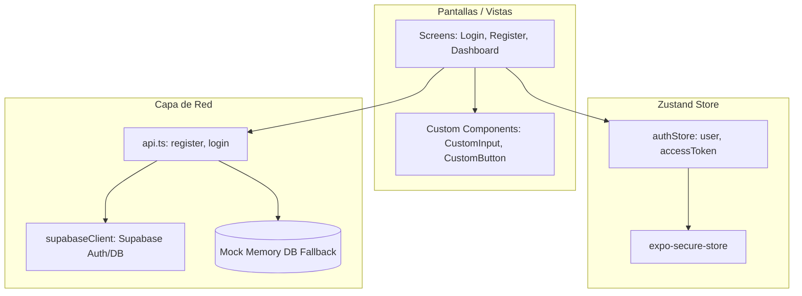

# 📱 Jóvenes al Ruedo — Mobile App

**Proyecto educativo — SENA, Ficha 3171599 | Junio 2026**

Aplicación móvil híbrida para la plataforma **Jóvenes al Ruedo**, diseñada con **React Native** y **Expo** para proveer a los jóvenes artistas una experiencia nativa y fluida para el registro, login y visualización de ofertas en el sector creativo.

---

## 📋 Tabla de Contenidos

- [Características Principales](#características-principales)
- [Arquitectura de la Aplicación](#arquitectura-de-la-aplicación)
- [Estructura del Proyecto](#estructura-del-proyecto)
- [Prerrequisitos](#prerrequisitos)
- [Instalación y Configuración](#instalación-y-configuración)
- [Desarrollo y Ejecución](#desarrollo-y-ejecución)
- [Integración con Supabase & Fallback Local](#integración-con-supabase--fallback-local)
- [Depuración en Navegador Web (F12)](#depuración-en-navegador-web-f12)

---

## 🏗️ Arquitectura de la Aplicación

La aplicación móvil está estructurada siguiendo un flujo desacoplado y reactivo de datos basado en el patrón **Flux/Store** (mediante Zustand) y persistencia segura local:



### Componentes de la Arquitectura:
- **Capa de Vistas (`src/screens` & `src/components`)**: Componentes de React Native controlados por `react-hook-form` y validados con `zod`.
- **Capa de Estado Global (`src/stores`)**: Store Zustand centralizada que persiste la sesión del usuario de forma encriptada en el dispositivo con `expo-secure-store`.
- **Capa de Conectividad (`src/services`)**: Módulo adaptativo que detecta si el usuario configuró Supabase. Si está activo, consume la API en la nube; si no, conmuta automáticamente a un motor de persistencia Mock local en memoria para desarrollo Offline.

---

## ✨ Características Principales

1. **Autenticación Premium:** Interfaces de usuario refinadas y fluidas para el Registro, Inicio de Sesión, Recuperación y Cambio de Contraseña.
2. **Validaciones en Tiempo Real:** Validación de campos mediante esquemas de **Zod** (incluyendo la regla estricta de edad entre 18 y 28 años para registrarse como artista).
3. **Navegación Dinámica Segura:** Flujo estructurado a través de `AuthNavigator` que restringe el acceso al Dashboard para usuarios no logueados y redirige de forma segura tras autenticarse.
4. **Persistencia del Token JWT:** Uso de `expo-secure-store` para conservar de manera cifrada e inmutable el token del usuario en el dispositivo.
5. **Alertas Inteligentes Multiplataforma:** Utility helper (`customAlert`) que detecta dinámicamente si la app corre en iOS, Android o Navegador Web (`react-native-web`) para evitar el bloqueo del estado "Cargando".

---

## 🛠️ Stack Tecnológico

- **React Native** & **Expo SDK 51+**
- **TypeScript** (Tipado estático seguro)
- **Supabase JS Client v2** (Autenticación y persistencia en la nube)
- **Zustand** (Gestión de estado global liviana)
- **React Hook Form** + **Zod** (Manejo eficiente y validación de formularios)
- **React Navigation (Native Stack)** (Enrutamiento móvil)

---

## 📂 Estructura del Proyecto

```
Jovenes-al-ruedo-app/
├── assets/                 # Recursos estáticos (Logos, imágenes)
├── src/
│   ├── components/         # Custom inputs y botones estilizados
│   ├── navigation/         # Flujo de enrutamiento (AuthNavigator.tsx)
│   ├── screens/            # Pantallas (Login, Register, Dashboard, etc.)
│   ├── services/           # Cliente Supabase y llamadas a API
│   ├── stores/             # Estado global con Zustand (authStore.ts)
│   ├── types/              # Tipados de TypeScript y navegación
│   └── utils/              # Validaciones y utilidades de alertas
├── App.tsx                 # Inicializador principal y proveedor de navegación
├── app.json                # Configuración global de la app Expo
└── package.json            # Dependencias fijadas (pinned)
```

---

## ✅ Prerrequisitos

- **Node.js 20 LTS+**
- **pnpm 9+** (Instalación: `npm install -g pnpm`)
- **Expo Go** instalado en tu celular físico (iOS o Android) si deseas probar en hardware real.

---

## 🚀 Instalación y Configuración

### 1. Descargar dependencias
Desde la raíz de la carpeta `Jovenes-al-ruedo-app/`:
```bash
pnpm install
```

### 2. Variables de Entorno y Conectividad
Abre el archivo [supabaseClient.ts](file:///c:/Users/jhoyn/Desktop/Proyecto%20del%20sena/Jovenes-al-ruedo-app/src/services/supabaseClient.ts) y configura tus llaves:
```typescript
const SUPABASE_URL = 'https://tu-proyecto.supabase.co';
const SUPABASE_ANON_KEY = 'tu-anon-key-de-supabase';
```

*Nota: Si dejas las constantes por defecto, la aplicación utilizará automáticamente un **motor Mock local simulado**, ideal para pruebas de desarrollo offline sin configurar una base de datos real.*

---

## ▶️ Desarrollo y Ejecución

Para iniciar el servidor de desarrollo de Expo CLI:
```bash
pnpm start
```

En la consola de Expo, puedes presionar:
- `a` para abrir en emulador de **Android**.
- `i` para abrir en simulador de **iOS**.
- `w` para compilar y abrir en el navegador **Web** (`http://localhost:8081`).
- Escanear el **código QR** desde la app **Expo Go** en tu celular para ejecutarlo en vivo.

---

## ☁️ Integración con Supabase & Fallback Local

Para garantizar un flujo de desarrollo ágil, la app detecta si has configurado las credenciales de Supabase en `supabaseClient.ts`:
- **Modo Supabase:** Registra y valida los usuarios en Supabase Auth.
- **Modo Mock Local (Desconectado):** Si no has modificado las credenciales, la app simulará de forma síncrona el registro, login y envío de correos utilizando una base de datos ficticia en memoria y arrojando warnings en consola.

---

## 👥 Autores

- **Franky Almario** - Desarrollador
- **Jhoyner Nova** - Desarrollador

**SENA — Ficha 3171599 | Junio 2026**
